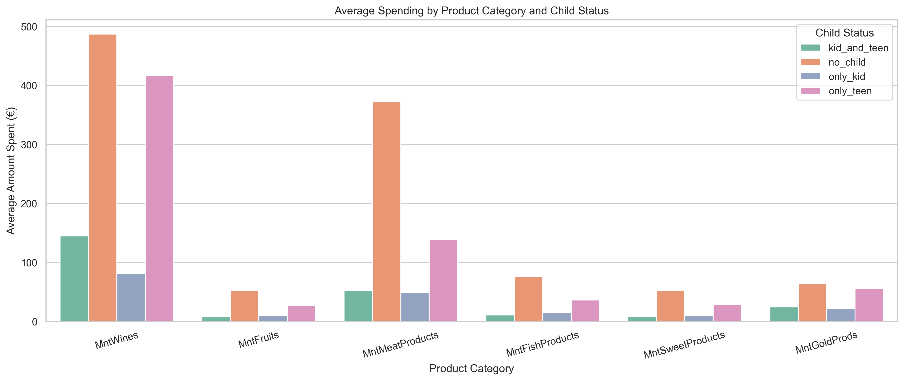
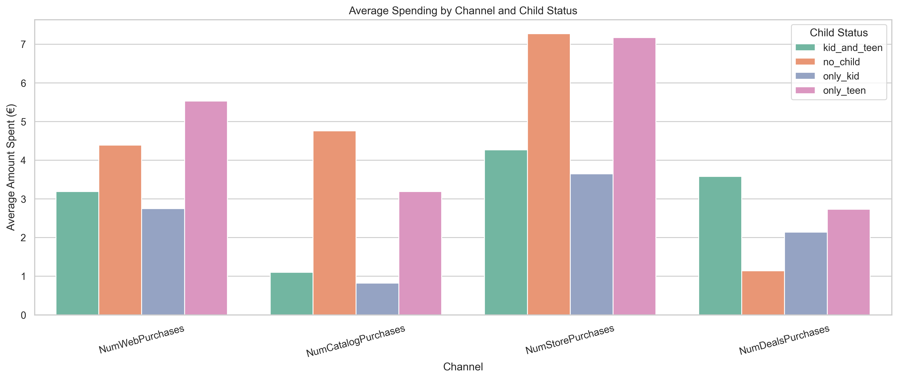
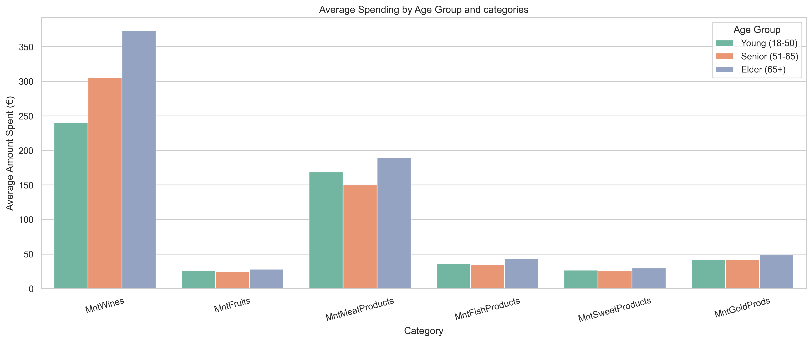
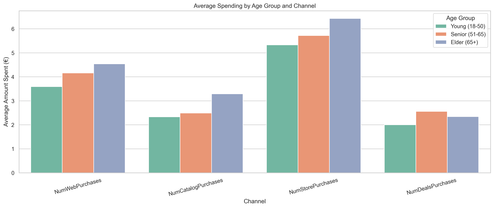
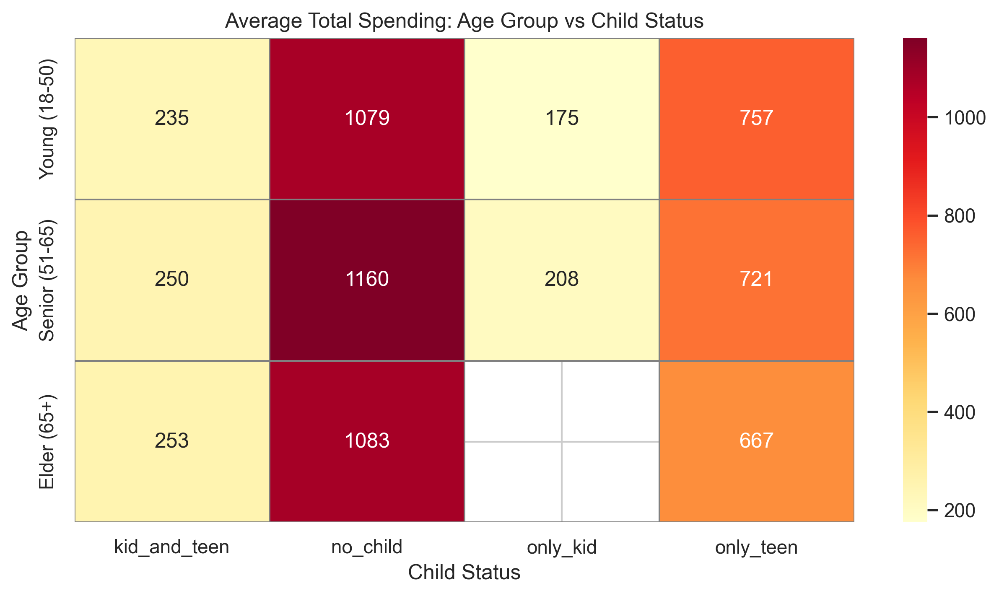
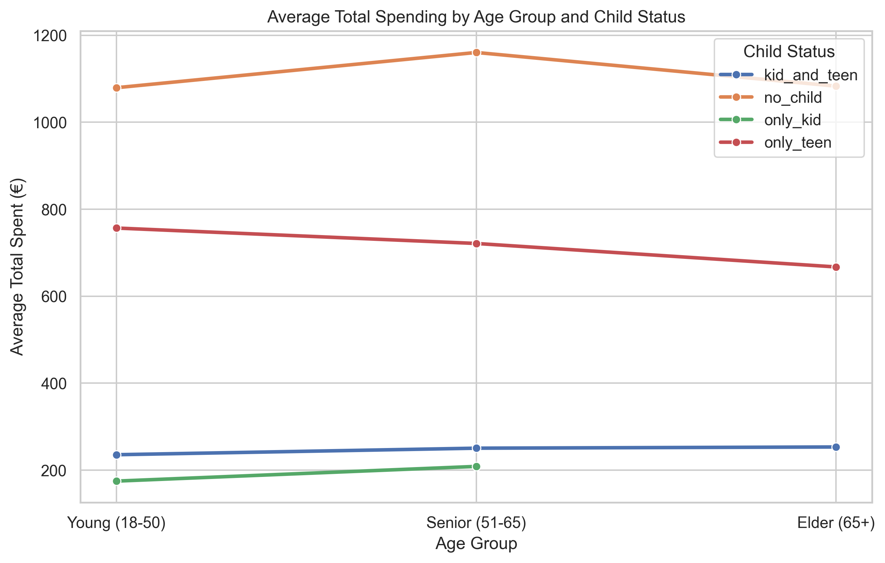
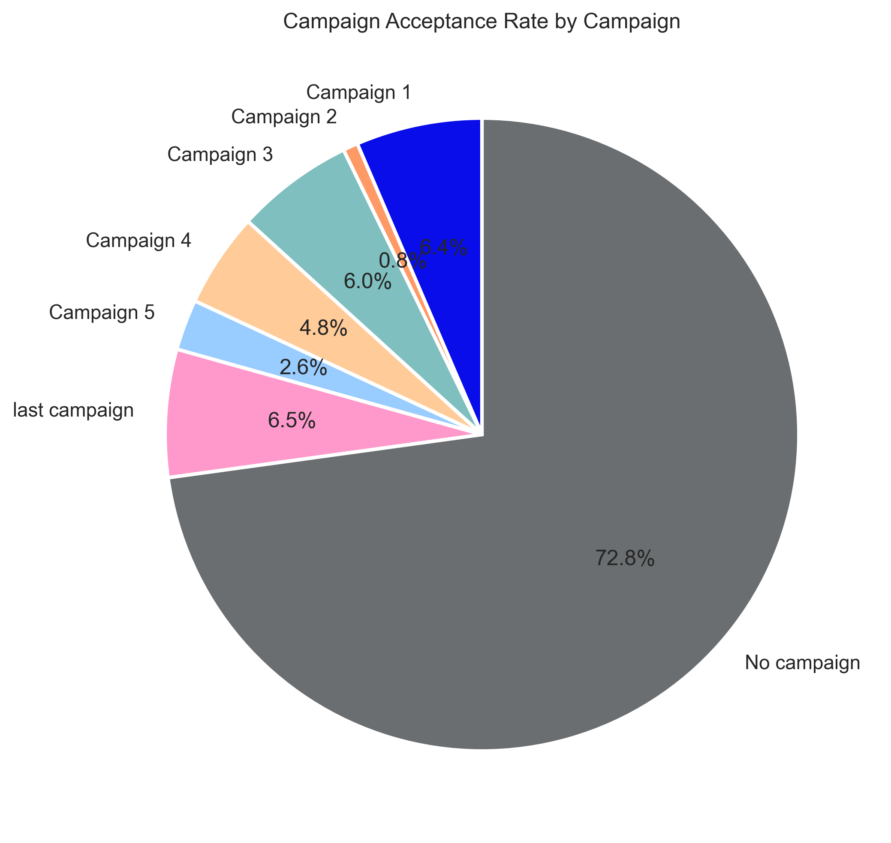
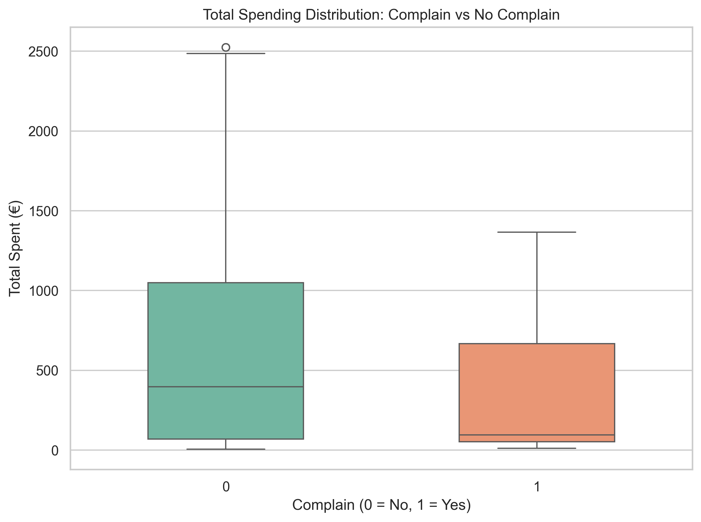

# Marketing Campaign Analysis
### Customer Behavior, Segmentation & Campaign Strategy

---

## Project Overview

This project analyzes customer purchasing behavior using a real-world marketing dataset.
The goal is to understand how demographic factors — such as having children, age, and 
relationship status — affect product preferences, sales channel usage, and campaign response.

The insights are then used to propose a data-driven campaign strategy tailored to each 
customer segment.

**Dataset:** [Customer Personality Analysis](https://www.kaggle.com/datasets/imakash3011/customer-personality-analysis)  
**Tools:** Python, pandas, matplotlib, seaborn  
**Next steps:** MySQL, Power BI, AI Agent for personalized campaign generation

---

## Project Structure

```
marketing-analysis/
│
├── marketing_analysis.ipynb    # Main notebook
├── data_clean/
│   └── marketing_data_clean.csv
└── charts/
    ├── average_spending_products_by_child.png
    ├── average_spending_channel_by_child.png
    ├── average_spending_category_by_Age.png
    ├── average_spending_channel_by_Age.png
    ├── average_total_spending_heatmap.png
    ├── average_total_spending_line.png
    ├── Campaign_Acceptance.png
    └── total_spending_complain.png
```

---

## Data Cleaning & Feature Engineering

The raw dataset (2,240 rows, 29 columns) was cleaned and restructured:

- Removed duplicate/constant columns (`Z_CostContact`, `Z_Revenue`, `ID`)
- Filled missing `Income` values with the median
- Removed 3 customers with impossible ages (126, 127, 133 years old)
- Converted `Dt_Customer` to datetime format
- Simplified `Education` → `higher_education` / `basic`
- Simplified `Marital_Status` → `relationship` / `single`
- Created `Child` column with 4 categories: `no_child`, `only_kid`, `only_teen`, `kid_and_teen`
- Created `Age_Group`: `Young (18-50)`, `Senior (51-65)`, `Elder (65+)`
- Created `Accepted_campaign`: which campaign (1–5) each customer accepted, if any
- Created `total_spent` and `total_purchased` as aggregate columns

**Final dataset:** 2,237 rows × 22 columns

---

## Analysis 1 — Child Status vs Product Spending



Customers without children spend significantly more across all product categories,
especially wine (€487) and meat (€372). Customers with teenagers show moderate spending,
while those with young children are the lowest spenders in every category.
Fruit and sweets remain low across all segments, indicating they are not key revenue drivers.

> **Campaign insight:** Target `no_child` and `only_teen` segments with premium product 
> promotions (wine, meat). Use budget-friendly offers for `only_kid` and `kid_and_teen`.

---

## Analysis 2 — Child Status vs Sales Channel



The store is the dominant channel across all segments. Customers without children lead 
in both store and catalog purchases, indicating a preference for premium channels. 
Customers with teenagers show the highest web activity, suggesting online shopping 
convenience. Customers with young children rely heavily on deals and discounts,
reflecting higher price sensitivity.

> **Campaign insight:** Focus catalog campaigns on `no_child`. Push web campaigns 
> and app-based offers toward `only_teen`. Use discount-driven promotions for `only_kid`.

---

## Analysis 3 — Age Group vs Product Spending



Wine spending increases steadily with age, with Elder customers (65+) spending 
significantly more than younger groups. Meat follows a similar trend, though Young 
customers also show relatively high spending, suggesting it is a staple across age groups.
Fruit, fish, sweets and gold remain flat across all age groups, indicating that age 
is not a significant driver for these categories.

> **Campaign insight:** Promote premium wines and meat to Elder and Senior segments. 
> Age-neutral categories (fruit, sweets) require different segmentation strategies.

---

## Analysis 4 — Age Group vs Sales Channel



All channels grow consistently with age — Elder customers are more active across 
web, catalog and store than younger groups. Contrary to expectations, web usage 
increases with age, suggesting that older customers with more time and disposable 
income shop online more frequently. Senior customers show the highest deal sensitivity,
while Elder customers are less price-driven.

> **Campaign insight:** Do not underestimate Elder customers on digital channels. 
> Target Seniors with time-limited discount offers.

---

## Analysis 5 — Combined: Age Group × Child Status




Child status is a stronger predictor of spending than age alone. Customers without 
children consistently show the highest average spending across all age groups 
(€1,079–€1,160), regardless of age. Customers with young children spend the least 
in every age group (under €210). The `only_teen` segment shows a steady decline 
with age, while `kid_and_teen` slightly increases — possibly reflecting later-in-life 
families with greater financial stability. Notably, Elder customers show no `only_kid` 
segment, which is expected given their age.

> **Campaign insight:** The most valuable segment is `no_child` + `Senior (51-65)` 
> with an average spend of €1,160. This should be the primary target for premium campaigns.

---

## Analysis 6 — Campaign Acceptance Rate



72.8% of customers did not accept any campaign. Among those who did, the last campaign 
was the most successful (6.5%), followed closely by Campaign 1 (6.4%) and Campaign 3 (6.0%).
Campaign 5 had the lowest acceptance rate (2.6%), suggesting diminishing returns 
across mid-series campaigns.

> **Campaign insight:** Current campaigns are underperforming significantly. 
> A 27% overall acceptance rate across all campaigns combined is too low. 
> Personalized campaigns based on segment (child status + age group) could 
> substantially improve conversion rates.

---

## Analysis 7 — Complaints vs Spending



Customers who complained show a compressed spending distribution with a lower median 
(~€100) compared to non-complainers (~€400). High-value customers (outliers above €2,000) 
appear exclusively in the non-complainer group. Recency is nearly identical between 
the two groups, suggesting that dissatisfied customers do not immediately disengage 
but do spend significantly less.

> **Campaign insight:** Complaints are an early signal of disengagement. 
> A dedicated retention campaign for complaining customers — focused on service 
> recovery and personalized offers — could recover lost revenue before churn occurs.

---

## Key Findings Summary

| Factor | Impact on Spending | Key Segment |
|---|---|---|
| Child Status | Very High | `no_child` spends 4–5x more than `only_kid` |
| Age Group | Moderate | Elder customers spend more on wine and meat |
| Age + Child | Very High | `no_child` + `Senior` = highest value segment (€1,160) |
| Sales Channel | Varies by segment | Store dominant; catalog for `no_child`; web for `only_teen` |
| Campaign Response | Low overall (27%) | Last campaign and Campaign 1 performed best |
| Complaints | Negative correlation | Complainers spend 35% less on average |

---

## Proposed Campaign Strategy

Based on the analysis, future campaigns should move away from a one-size-fits-all 
approach and adopt segment-specific targeting:

**Segment A — Premium (no_child, Senior/Elder)**
- Channel: Store + Catalog
- Products: Wine, Meat, Fish
- Message: Quality and exclusivity

**Segment B — Digital (only_teen, Young/Senior)**
- Channel: Web + App
- Products: Wine, Meat, Sweets
- Message: Convenience and variety

**Segment C — Value (only_kid, kid_and_teen)**
- Channel: Deals + Discounts
- Products: Budget-friendly categories
- Message: Value for money and family offers

**Segment D — Retention (Complainers)**
- Channel: Direct (email/personalized)
- Products: Based on past purchases
- Message: Service recovery + exclusive loyalty offer

---

## Next Steps

- [ ] Load cleaned dataset into **MySQL** and replicate analysis with SQL queries
- [ ] Build **Power BI** dashboard with interactive segment filters
- [ ] Develop an **AI Agent** (Anthropic SDK) that generates personalized campaign 
      copy for each customer segment based on this analysis

---

*Analysis by: Matteo Papucci | May 2026*
